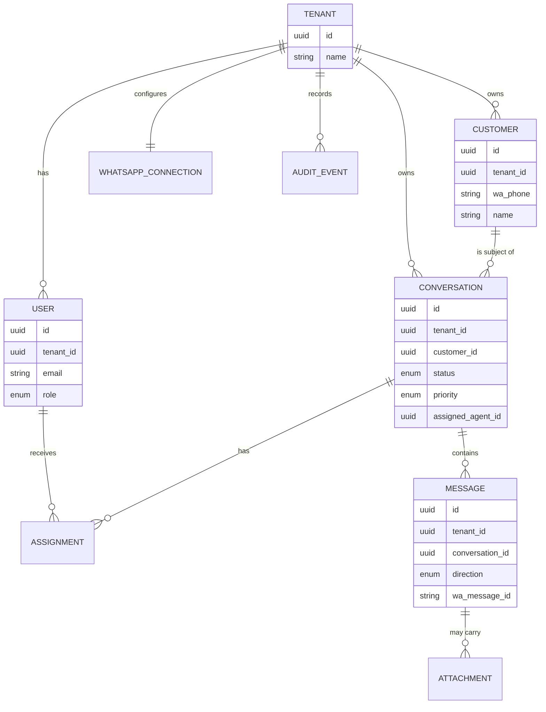

# Domain Model

**Status:** Accepted · v0.1

The whole system — code, database, APIs, docs — uses **one vocabulary**. If a word isn't here, we don't use it in the code.

---

## Glossary

| Concept | Meaning |
|---|---|
| **Tenant** | A business using the platform. The top-level isolation boundary. |
| **User** | An authenticated platform user (belongs to one tenant). |
| **Agent** | A user who handles customer support. |
| **Customer** | An external person messaging a business via WhatsApp. Never a platform user. |
| **Conversation** | A support interaction with a customer, owned by a tenant. |
| **Message** | A single communication, inbound or outbound. |
| **Assignment** | The responsibility link between a conversation and an agent. |
| **WhatsApp Connection** | A tenant's configuration binding it to its WhatsApp Business account. |
| **Attachment** | Media/file associated with a message; bytes live in object storage. |
| **Audit Event** | A record of an important system action. |

## Core principle

> **WhatsApp is an integration, not the domain.** The domain is *customer conversation management*. WhatsApp is one way conversations arrive. Model conversations, customers, and assignments as first-class — keep WhatsApp identifiers at the edge.

## Entity relationships



Every tenant-owned entity carries `tenant_id`. That column is not convenience — it is the security boundary (see [architecture principles](../03-architecture/architecture-principles.md)).

## Lifecycles

**Conversation status**

```
OPEN ──assign──▶ ASSIGNED ──resolve──▶ CLOSED
  ▲                                       │
  └───────────── reopen ──────────────────┘
```

A new inbound message on a `CLOSED` conversation **reopens that same conversation** rather than starting a new one — see [ADR-013](../08-decisions/decision-log.md#adr-013--conversation-reopen-semantics). Full schema-level treatment (indexes, constraints) is deferred to `database-design.md`, authored in Phase 3/4.

**Message direction**

```
INBOUND   : customer → business  (created from webhook)
OUTBOUND  : agent → customer      (created on send; status tracked via webhook)
```

**Message status** (outbound, driven by WhatsApp webhooks): `PENDING → SENT → DELIVERED → READ`, with `FAILED` as a terminal branch.

## Aggregate boundaries

- **Conversation** is the central aggregate: it owns its messages, its status, and its current assignment. Almost all agent workflow operates through it.
- **Customer** is a long-lived entity that outlives any single conversation.
- **WhatsApp Connection** is a tenant-level singleton (v1: one WABA per tenant).

Keeping these boundaries clean is what lets modules stay decoupled and, if ever needed, be extracted.
