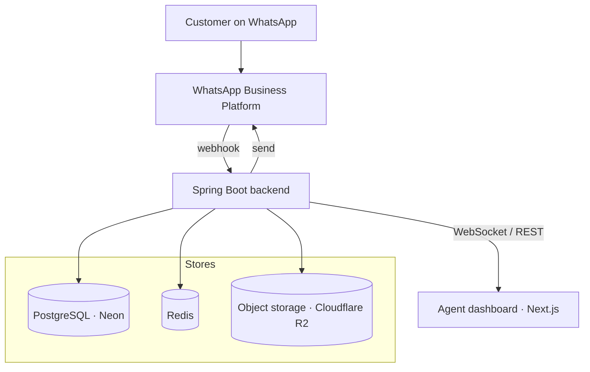
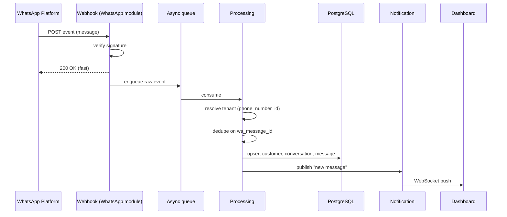
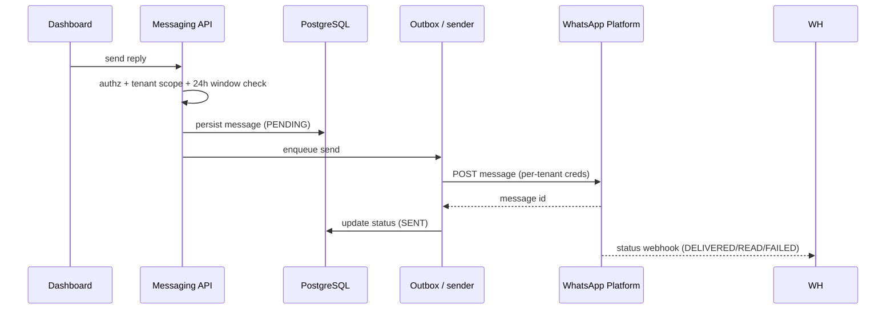

# System Architecture

**Status:** Accepted · v0.1

---

## 1. Architectural style — Modular Monolith

One Spring Boot application, internally divided into well-bounded business modules. **Not** microservices — we don't have the operational scale or team size that would justify the distributed-systems tax.

```
┌──────────────────────── Spring Boot application ────────────────────────┐
│                                                                         │
│  Auth    Tenant    Customer    Conversation    Messaging    Assignment  │
│                                                                         │
│  WhatsApp (integration)    Notification (realtime)    Storage    Audit  │
│                                                                         │
└─────────────────────────────────────────────────────────────────────────┘
```

Modules are separated **logically** and communicate through clear interfaces, so a genuinely hot one can be extracted later without a rewrite. Discipline now buys optionality later.

## 2. High-level topology



**Roles of each store:**

- **PostgreSQL (Neon)** — source of truth for all business state.
- **Redis** — ephemeral only: agent presence, WebSocket session data, conversation claim-locks, rate-limit counters. Never authoritative.
- **Cloudflare R2** — media/file bytes (S3-compatible); Postgres holds the metadata and object key.

## 3. Modules and responsibilities

| Module | Owns |
|---|---|
| **Auth** | Authentication, sessions/tokens, role checks |
| **Tenant** | Organizations, workspace config, tenant isolation plumbing |
| **Customer** | Customer identity and profile, per-tenant |
| **Conversation** | The central aggregate: status, priority, history |
| **Messaging** | Message persistence, inbound/outbound, 24h-window rules |
| **Assignment** | Claiming, assigning, reassignment, collision control |
| **WhatsApp** | The integration boundary: webhooks, tenant resolution, send, status, idempotency, credentials |
| **Notification** | Realtime fan-out over WebSocket |
| **Storage** | Object-storage read/write and signed URLs |
| **Audit** | Recording sensitive actions |

The **WhatsApp module is a boundary, not a leak.** No other module talks to Meta directly — they speak to the WhatsApp module's interface. See [whatsapp-integration.md](whatsapp-integration.md).

## 4. Inbound flow (customer → agent)



The **fast-ACK + async processing** split is deliberate: it satisfies NFR-PERF-002 and prevents Meta's retries from becoming duplicate storms.

## 5. Outbound flow (agent → customer)



Outbound sends go through an **outbox** so a transient Meta failure is a retry, not a lost reply.

## 6. Multi-tenancy at the architecture level

One shared database, tenant-scoped by `tenant_id`. The tenant is **derived from the authenticated security context or the trusted webhook→tenant mapping — never from a client-supplied value.** This is the platform's central security boundary; it is enforced in code and, as defense-in-depth, may be reinforced with Postgres Row-Level Security.

## 7. What is intentionally absent

No message broker cluster, no service mesh, no per-tenant databases, no Kubernetes on day one. Each of those is a real cost with no v1 payoff. They enter only when a measured need — not a resume — demands them.
